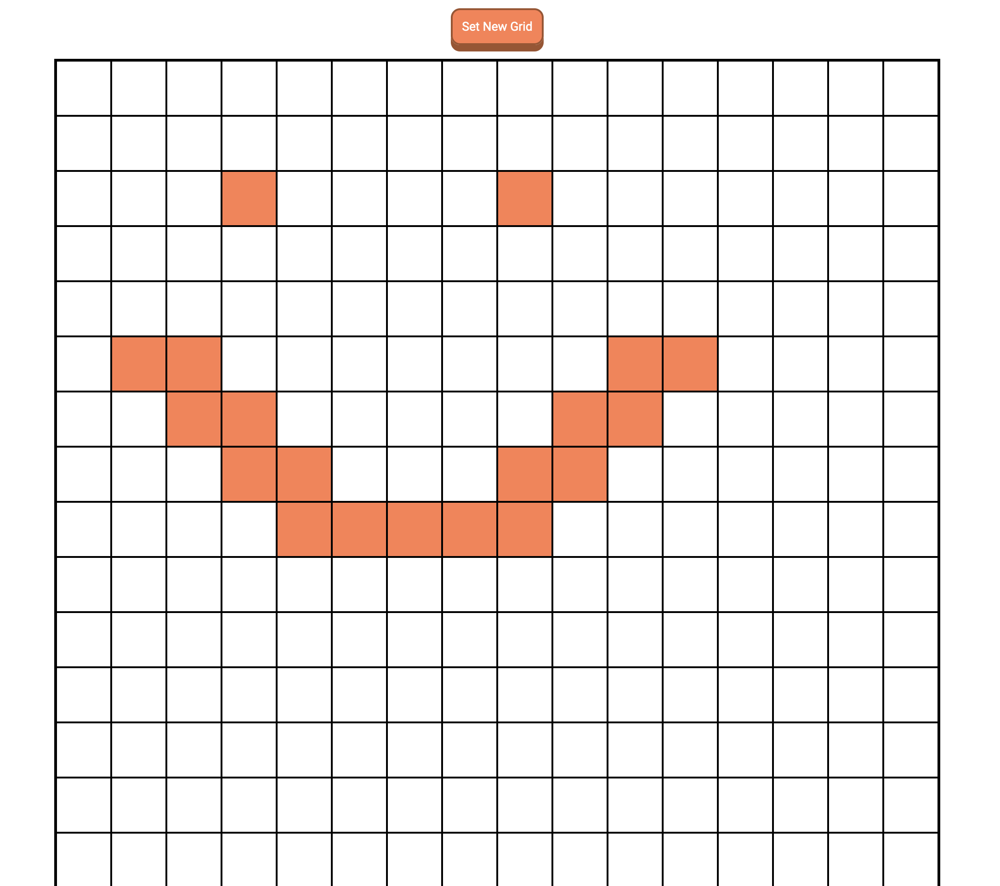
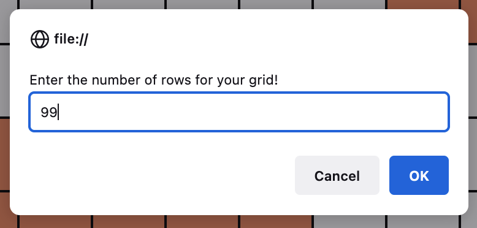
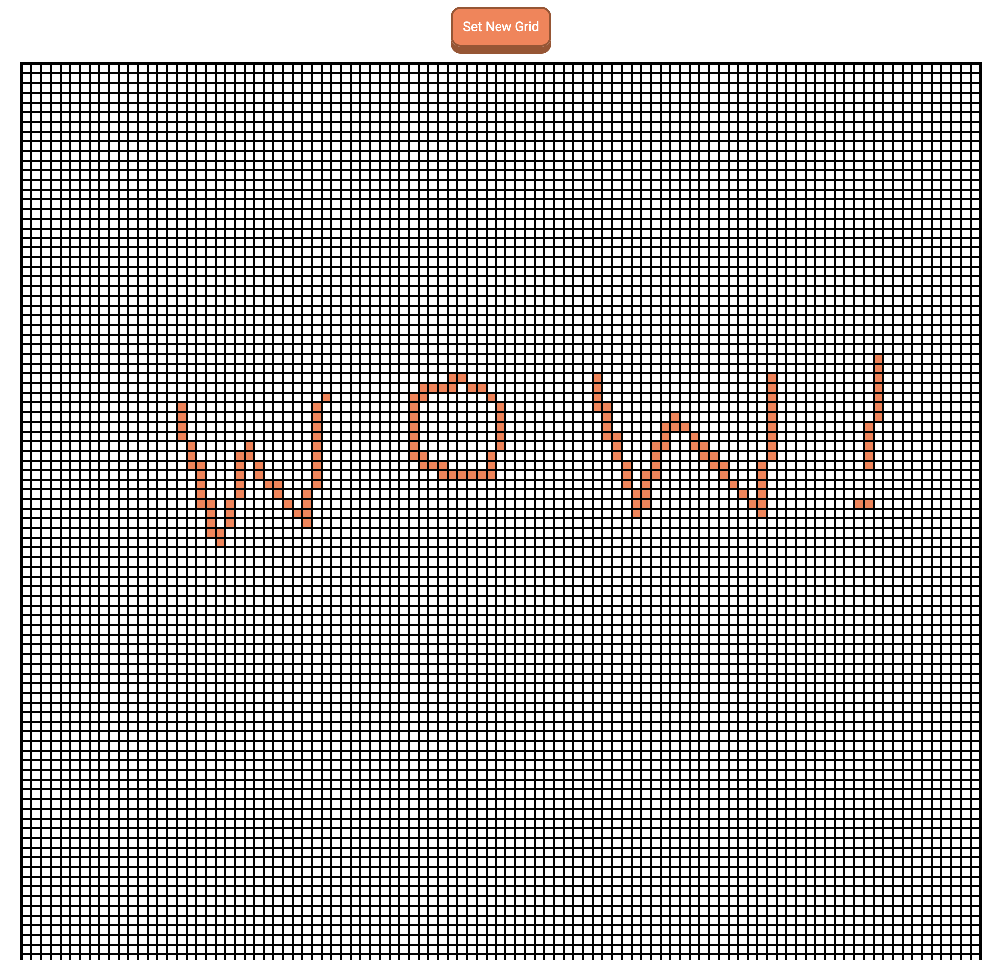

# top-etchasketch
A website that allows you to "sketch" with a grid. It's very simple; just hover your mouse over the squares to color them!

To reset your sketch as well as the number of squares for your sketchboard, click "set new grid" and set any amount of rows from 1-100!

That's about it. Hope you enjoy this small JS project I made!
